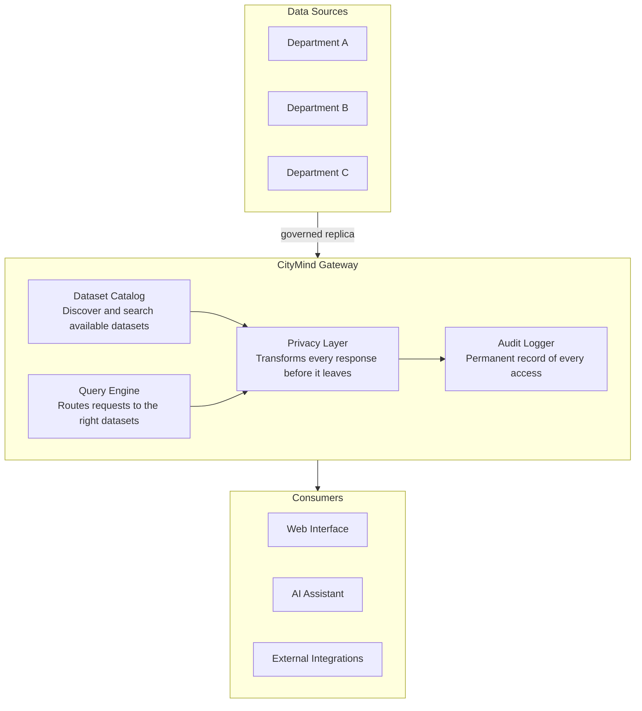
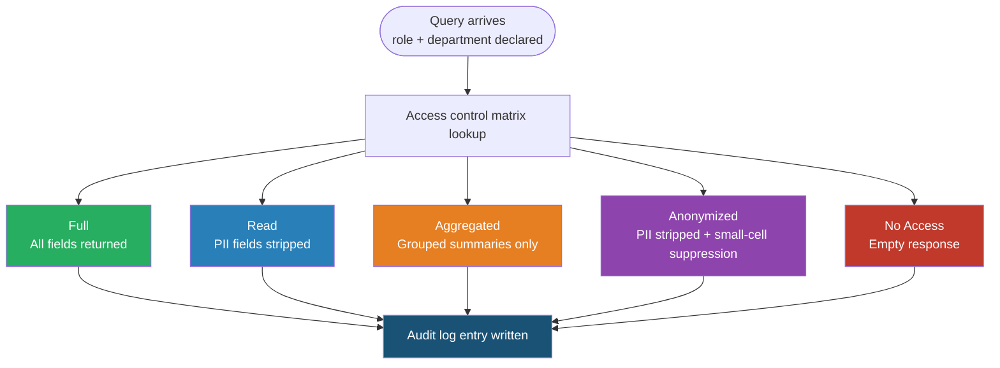
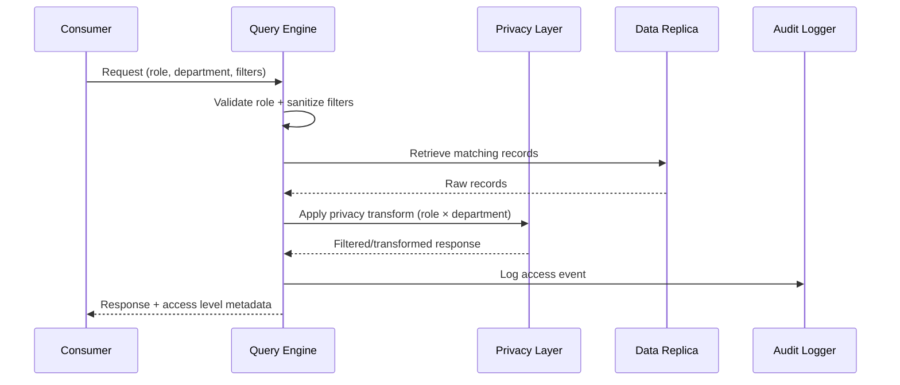
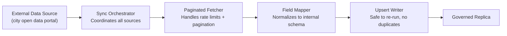

# CityMind — System Design

**The Secure Data Nervous System for Waterloo Region**

> FCI Winter 2026 Hackathon · Problem Statement #2: Build the Blueprint for Municipal Data Infrastructure

---

## Problem Statement

City departments operate in silos. Each department maintains its own data systems and has legitimate reasons to guard them — raw records may contain PII, sensitive infrastructure details, or legally protected information. The result is that cross-departmental decisions either stall or get made on incomplete information.

CityMind is the governed connection layer between departments and the people who need answers from them.

---

## High-Level Architecture

---

## Components

### Data Replica

Departments do not expose their live systems to the gateway. Instead, CityMind maintains a governed local replica, synced incrementally from each department's data source. This means:

- Departments keep their systems unchanged
- Queries are fast and isolated from upstream load
- Every field in the replica is classified by sensitivity before ingestion

### Dataset Catalog

A registry of all available datasets. Each entry describes what the dataset contains, which department owns it, how sensitive it is, and what fields are available. Consumers discover and search the catalog before querying.

### Query Engine

Accepts requests with a declared role and target department. Validates the request, retrieves the relevant data from the replica, and passes it to the Privacy Layer before returning anything to the caller.

### Privacy Layer

The core enforcement mechanism. Every response passes through this layer — nothing reaches a consumer unfiltered. The layer applies one of five transforms based on who is asking and what they are asking about:

| Access Level | What the caller receives |
|---|---|
| **Full** | Complete record, all fields |
| **Read** | Record with sensitive fields removed |
| **Aggregated** | Group-level summaries only, no individual records |
| **Anonymized** | Sensitive fields removed; result suppressed if fewer than 5 records match |
| **None** | Empty response |

The mapping of roles to access levels per department is defined in a central access control matrix. It cannot be bypassed by the caller.

### Audit Logger

Every query — regardless of whether data was returned — writes an immutable log entry recording the caller's role, the department queried, the filters applied, the access level granted, the number of records returned, and whether any suppression was triggered. This log is accessible to governance reviewers and exposed in the web interface.

### AI Assistant

A natural language interface that translates plain-English questions into governed API calls. It uses the same query endpoint as every other consumer — no special access — and surfaces the access level and any suppression notices alongside every answer, making governance visible rather than hiding it behind a friendly interface.

### Web Interface

A multi-page interface for human consumers. Exposes dataset discovery, role-based querying, cross-department analysis, a map view with real geometry, the full audit log, and sync health status. The Citizen Portal page restricts itself to public-sensitivity datasets only.

---

## Privacy Model

Small-cell suppression prevents re-identification: if a filtered result set contains fewer than 5 records, the response is withheld entirely and the suppression is flagged in the audit log.

---

## Data Flow

---

## Sync Architecture

Syncs are idempotent. Every sync run is recorded with timestamps, record counts, and error details.

---

## Scalability

The architecture scales horizontally along two axes:

**More departments** — adding a department means registering its datasets in the catalog and defining its row in the access control matrix. No changes to the gateway logic.

**More consumers** — the query endpoint is stateless. Any number of web interfaces, AI agents, or external integrations can call it concurrently without coordination.

The privacy enforcement and audit logging are applied uniformly regardless of scale. Governance does not degrade as the system grows.
